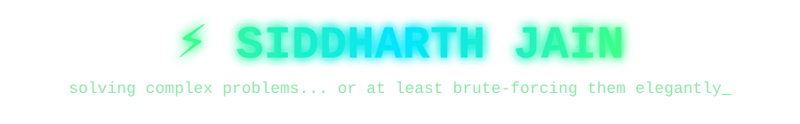
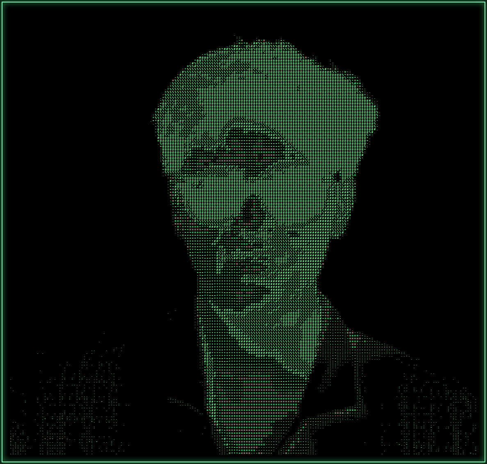

<table>
<tr>
<td valign="top">



<p align="left">
AI/ML Member @ Microsoft Innovators Club&nbsp;|&nbsp;Data Science Member @ IEEE RAS&nbsp;|&nbsp;IoT & Edge Computing Enthusiast
</p>

<p align="left">
<a href="https://www.linkedin.com/in/siddharth-jain-60a444379"></a>
<a href="mailto:sidjain10116@gmail.com"></a>
<a href="https://leetcode.com/u/sidjain10/"></a>
</p>

</td>
<td valign="top" width="260">

</td>
</tr>
</table>

---

### 💻 System Info

```
siddharth@jain
---------------
OS: B.Tech CSE (Core) @ VIT Chennai
Host: First-Year Undergraduate
Kernel: IoT & Hardware Prototyping v1.0
Uptime: 24/7 (Fueled by Competitive Programming)
Shell: C, C++, Python, Java
Hardware: Arduino, ESP32, Custom Sensors
AI/ML: Edge Computing, Surveillance, Data Science
Philosophy: Bridge the gap between software and physical reality.
```

### 👤 About Me

I'm a Computer Science undergraduate at VIT Chennai with a deep interest in both high-level software development and low-level hardware systems. I like problems that sit at the intersection of code and the physical world — from edge-computing surveillance to simulating black hole physics in Python.

My personal philosophy: **solve complex problems... or at least brute-force them elegantly.**

### 🎓 Education

- **Vellore Institute of Technology (VIT), Chennai**
  - B.Tech in Computer Science Engineering (Core) *(2025 – 2029)*
- **Schooling (ICSE/ISC)**
  - Grade 12 — 95.75%
  - Grade 10 — 97%
  - Academic Excellence Award & School Topper

---

### 🧪 Experience & Leadership

- **Independent Research** — *Present*
  - Developing a computational simulation modeling black hole information preservation.
  - Implemented Python algorithms to simulate Quantum Tunneling effects and test Bell's Inequality.
- **Microsoft Innovators Club (MIC), VIT Chennai** — AI/ML Member *(2025 – Present)*
  - Participating in workshops on AI/ML; gaining hands-on experience training algorithms transferable to physics simulations.
- **IEEE Robotics and Automation Society (RAS), VIT Chennai** — Data Science Member *(2025 – Present)*
  - Collaborating with the technical team to explore data-driven solutions for robotics, applying Python and statistical methods to scientific data.

---

### 🛠 Tech Stack

**Languages:**


**AI & Data Science:**


**Backend & Real-Time:**


**Hardware & Tools:**


**Core Areas:** `Data Structures & Algorithms` · `Competitive Programming` · `Internet of Things (IoT)` · `Edge Computing` · `Object-Oriented Programming`

---

### 📁 Projects & Labs

```
siddharth@jain:~ $ tree --level 2 ~/projects/
~/projects
├── sahayak-ai [FastAPI | RAG Pipeline | WebRTC]
│   └── Real-time AI assistant with retrieval-augmented generation and live voice/video streaming
├── edge-ai-surveillance [Python | Computer Vision | IoT]
│   └── Edge-computing-based AI surveillance for restricted zone monitoring
├── quantum-blackhole-sim [Python | Physics]
│   └── Quantum simulation of black hole information dynamics using spin simulations
├── smart-env-monitor [ESP32 | DHT22 | MQ-135 | IoT]
│   └── Real-time air quality, temperature & humidity telemetry with cloud dashboards
├── pokemon-showdown-ai [Python | OOP]
│   └── Predictive battle simulator, 92% accuracy on optimal counter-moves
├── reverse-akinator [Python]
│   └── Logic-based guessing game engine
└── hackathon-prototypes [Python | TensorFlow | NLP]
    ├── Multilingual Translator — real-time NLP text processing
    └── Insulin Tracker — backend data management
```

**Detailed Breakdown:**

- **Sahayak AI**
  - Built an advanced AI assistant system integrating a FastAPI backend with a Retrieval-Augmented Generation (RAG) pipeline for context-aware responses.
  - Implemented WebRTC for real-time, low-latency voice/video interaction with the assistant.
- **Edge AI Surveillance**
  - Proposed and developed a system focusing on edge-computing-based AI surveillance to monitor restricted zones.
- **Quantum Black Hole Simulation**
  - Developed a physics-centric computing project simulating black hole information dynamics using spin simulations.
  - Implemented Quantum Tunneling simulations and tests of Bell's Inequality in Python.
- **Smart Environmental Monitoring System (IoT)**
  - Engineered a scalable, low-cost IoT architecture using ESP32 microcontrollers, DHT22, and MQ-135 sensors for real-time telemetry.
  - Integrated cloud dashboards (Blynk/Thingspeak) for remote visualization and automated threshold alerting.
- **Pokémon Showdown AI Simulator**
  - Engineered an interactive battle simulation using OOP to model game states, attributes, and turn-based mechanics.
  - Integrated a predictive algorithm achieving 92% accuracy in predicting optimal counter-moves and state transitions.
- **Reverse Akinator Game**
  - Engineered a logic-based application applying CS fundamentals to process user inputs efficiently.
- **Hackathon Prototypes**
  - Multilingual Translator using TensorFlow and NLP pipelines for real-time text processing.
  - Insulin Tracker with robust backend data management and algorithmic efficiency.

---

### 🌱 Philosophy & Musings

> *"If it can be brute-forced elegantly, it's already half-solved."*

- **Curiosity First:** From black holes to backend systems, I follow the interesting problem.
- **Hardware Meets Software:** I like closing the loop between code and the physical world.
- **Consistency:** Practicing DSA daily on LeetCode to keep the fundamentals sharp.
- **Growth:** Debate, MUN, and public speaking taught me to think on my feet — same instinct I bring to debugging.

### 🎯 Interests & Hobbyist Pursuits

`Strength Training & Fitness` · `Basketball` · `Audiophile Tech` · `Hardware Hacking` · `Debate & MUN` · `Dramatics`

---

```
siddharth@jain:~ $ ping -c 1 contact.siddharth.jain
```

- 📧 **Email:** [sidjain10116@gmail.com](mailto:sidjain10116@gmail.com)
- 💼 **LinkedIn:** [Siddharth Jain](https://www.linkedin.com/in/siddharth-jain-60a444379)
- 🧩 **LeetCode:** [sidjain10](https://leetcode.com/u/sidjain10/)

*Got a wild idea, a challenging problem, or want to talk AI, IoT, or physics? Feel free to reach out — I'm probably already thinking about something similar!*
